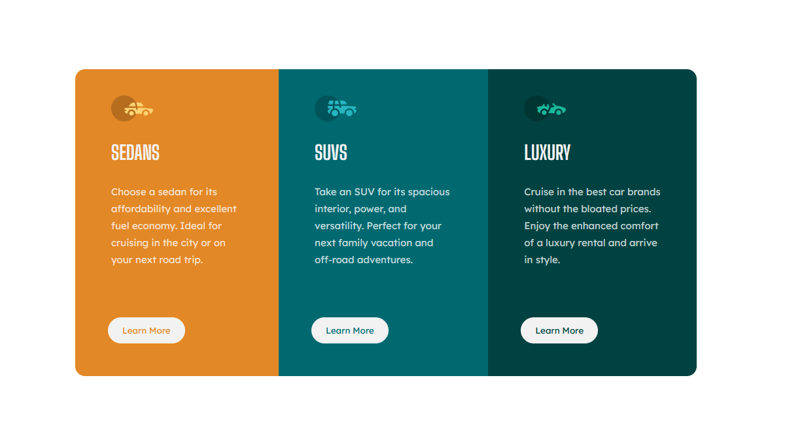

# Frontend Mentor - 3-column preview card component solution

This is a solution to the [3-column preview card component challenge on Frontend Mentor](https://www.frontendmentor.io/challenges/3column-preview-card-component-pH92eAR2-). Frontend Mentor challenges help you improve your coding skills by building realistic projects. 

## Table of contents

- [Overview](#overview)
  - [The challenge](#the-challenge)
  - [Screenshot](#screenshot)
  - [Links](#links)
- [My process](#my-process)
  - [Built with](#built-with)
  - [What I learned](#what-i-learned)
- [Author](#author)

## Overview

### The challenge

Users should be able to:

- View the optimal layout depending on their device's screen size
- See hover states for interactive elements

### Screenshot



### Links

- Solution URL: [Add solution URL here](https://your-solution-url.com)
- Live Site URL: (https://egatlov.github.io/Frontend-mentor-3-column-card/)

## My process

### Built with

- Semantic HTML5 markup
- CSS custom properties
- CSS Grid
- Mobile-first workflow

### What I learned

How to add ease-in-out transition to button

```html
<button class="btn bright-orange">Learn More</button>
```
```css
.btn{
	padding: 10px 20px;
	margin-left: 20px;
	margin-bottom: 20px;
	border-radius: 50px;
	border-color: var(--Very-light-gray);
	border-style: solid;
	font-family: 'Lexend Deca', sans-serif;
	background-color: var(--Very-light-gray);
	transition: 0.3s;
}

.btn:hover{
	cursor: pointer;
	background-color: transparent;
	color: var(--Very-light-gray);
	border: 2px solid var(--Very-light-gray);
}

```

## Author

- Frontend Mentor - [@Egatlov](https://www.frontendmentor.io/profile/Egatlov)